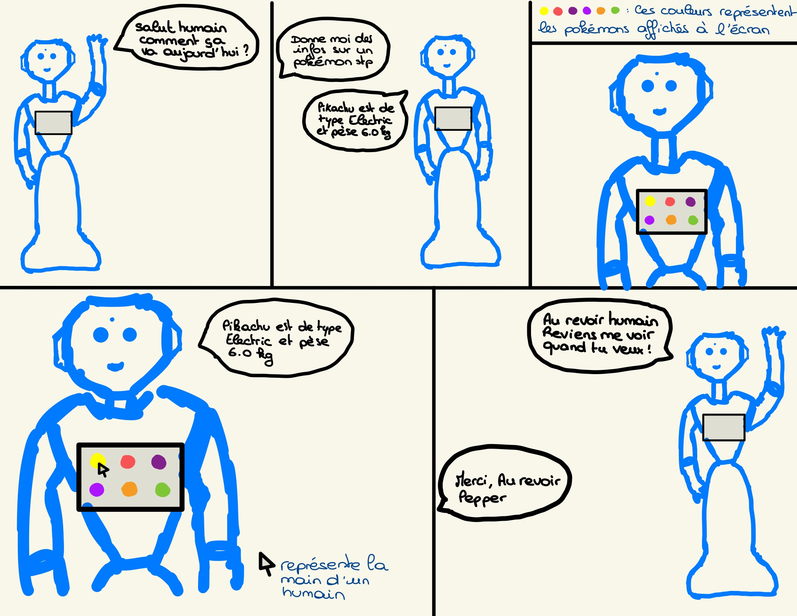

# 🤖 Projet Pepper Robsa

Ce projet permet au robot **Pepper** d’interagir avec les utilisateurs en leur donnant des **informations sur des Pokémon**. Il combine des **gestes**, de la **synthèse vocale**, un **dialogue naturel en français**, et une **interface web** affichée sur la tablette du robot.

## 🧠 Fonctionnalités
- 💬 Dialogue en langue française autour de Pokémon.
- 📱 Interface tactile sur la tablette de Pepper avec images cliquables.
- 🔁 Intégration de la **PokéAPI** pour obtenir des infos en temps réel (types, poids).
- 🎭 Gestes de Pepper pendant certaines répliques.
- 🧠 Réception d’événements via **ALMemory** pour déclencher des actions depuis l'interface tablette.

## 🗂️ Structure du projet

```php
projet_pepper_1/
│
├── html/                       # Dossier avec les contenus pour afficher sur la tablette
│   └── images/                 # Dossier avec les images des Pokémons
│   └── js/                     # Dossier pour le fichier javascript
│   └── index.html              # Page html à afficher sur la tablette
├── app.py                      # Script Python qui gère le module et la logique
├── dialogue.top                # Fichier de dialogue
├── dialogue_non_ethique.top    # Fichier de dialogue non éthique
├── README.md
```

## ⚙️ Installation & lancement

Avant de démarrer, assure-toi d'avoir transféré :

- Le fichier `.top` sur le robot (dans le bon chemin),
- Le fichier HTML de l'interface web,
- Le script Python `app.py`

### 🔌 Méthode 1 — Depuis le robot Pepper (via SSH)
1. Se connecter en SSH au robot :
```bash
ssh nao@"adresseIPduPepper"
``` 
2. Aller dans le dossier de l'application :
```bash
cd /home/nao/.local/share/PackageManager/apps/projet_pepper_1
```
3. Lancer le script :
```bash
python app.py
```
Remplace `app.py` par le nom réel de ton fichier Python si besoin.

### 💻 Méthode 2 — Depuis un PC avec NAOqi (2.5.x) installé

1. Lancer le script Python localement, en spécifiant l’adresse IP du Pepper : (ne pas oublier de mettre l'adresse ip du pepper dans `app.py`)
```bash
python app.py --ip "adresseIPduPepper"
```
⚠️ Assure-toi que :
- Le fichier `.top` et le dossier `html` sont déjà transféré sur le robot.

## 🤖 Dialogue Éthique

Dans le cadre de la partie éthique de notre projet avec le robot Pepper, nous avons conçu un dialogue centré sur l’univers des Pokémon, un thème familier et apprécié par un large public, notamment les enfants. L’objectif était de proposer une interaction positive, engageante et bienveillante. Le robot adopte un ton chaleureux, respecte les règles de politesse, et fait preuve d’écoute en s’adaptant aux différentes formulations de l’utilisateur.
Le dialogue a été pensé pour favoriser la confiance, encourager la curiosité et créer un lien agréable avec la machine. À travers des réponses simples, claires et respectueuses, le robot se comporte comme un compagnon interactif, capable de transmettre des informations sans jugement, ni autorité excessive.
En choisissant un comportement exemplaire dans ses échanges, cette version éthique du robot illustre l’importance de concevoir des personnalités robotiques alignées avec les valeurs humaines. Elle montre à quel point le langage, le ton, et les intentions du robot peuvent influencer l’expérience utilisateur, surtout lorsqu’il s’adresse à un public jeune. Ce travail met en lumière le rôle central de l’éthique dans le développement de systèmes d’intelligence artificielle destinés à interagir avec des êtres humains, et la nécessité de fixer des limites claires dès la phase de conception.

## ⚠️ Dialogue Non Éthique 

Dans le cadre de la partie non-éthique de notre projet Pepper, nous avons fait le choix de créer un comportement de dialogue autour du thème des Pokémon, un univers principalement destiné aux enfants. Dans cette partie, le robot interagit de manière provocante, il utilise un langage familier, certains mots blessants et manque de patience dans ses interactions. Le choix du thème des Pokémon, et ainsi le choix du public principal (les enfants), renforce la portée dérangeante de notre scénario. En ciblant un public jeune, qui manque encore de sens critique, cette attitude peut avoir un impact psychologique plus fort. Effectivement, la période de l’enfance est significative de période de construction. Ainsi, le robot aurait de l’impact notamment en termes d’inconfort, de perte de confiance, ou de rejet de la technologie. Cette situation nous permet de réfléchir aux dangers d’une conception non éthique de la personnalité d’un robot, en particulier dans des contextes où le robot est susceptible d’interagir avec un public vulnérable, comme les enfants. Cela souligne l’importance de mettre en place des règles strictes dès la phase de développement des robots.

## 📹 Lien vers la Vidéo sur Youtube 

[Vidéo Youtube de notre projet](https://youtu.be/ahAdG7nPVrU)

## 🎬 Story Board 

